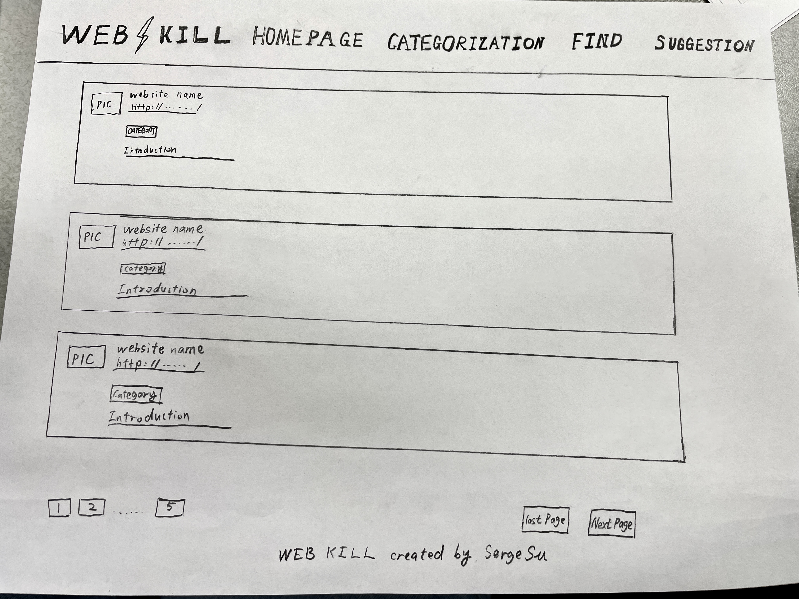
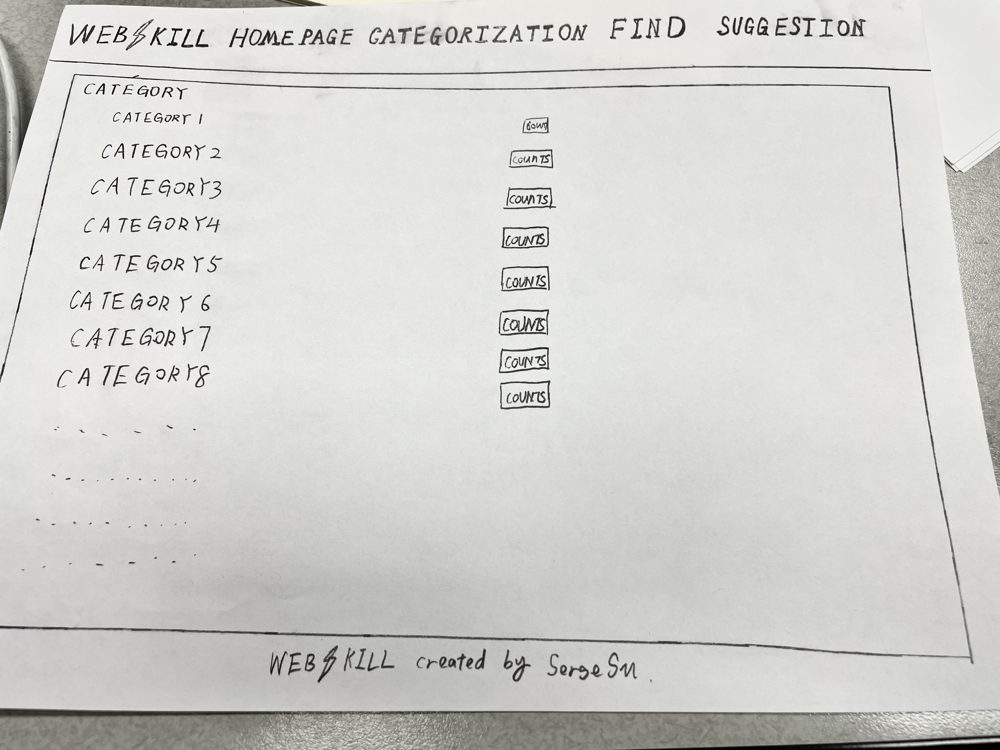
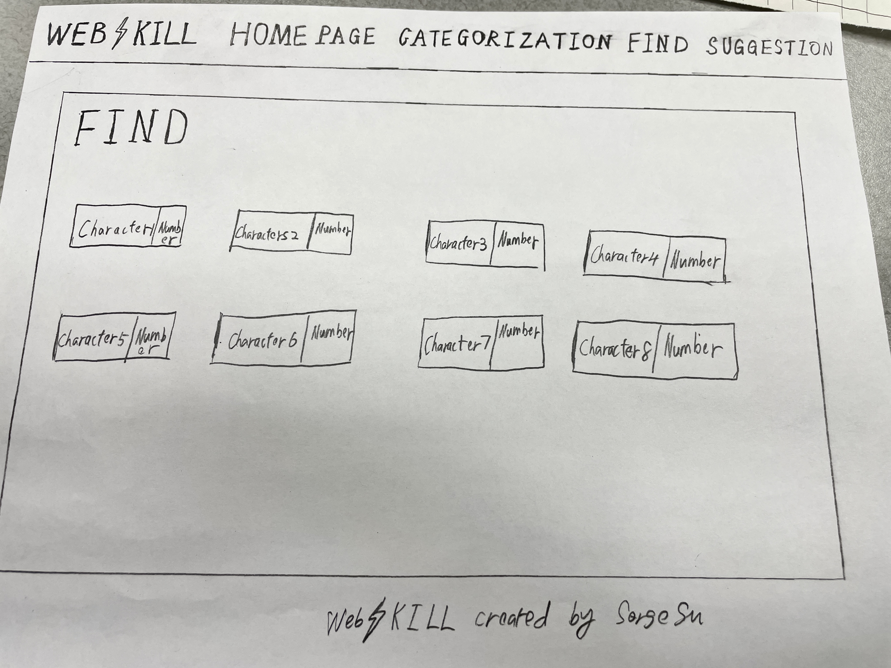
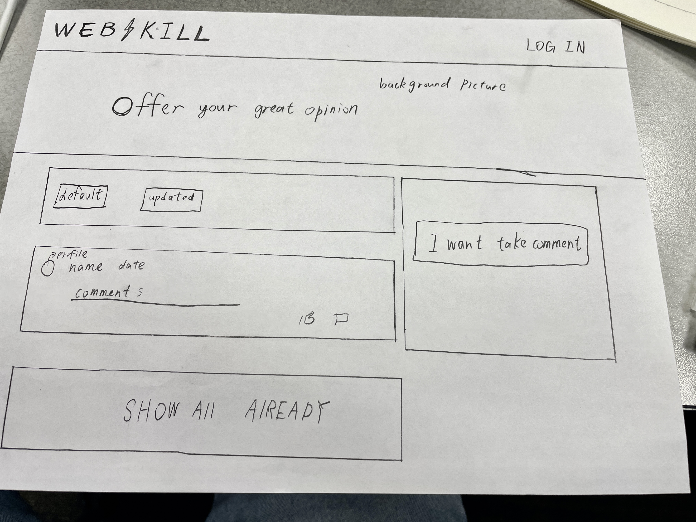

# startup-cs260-winter-2024

## Elevator Pitch

My startup project is for categorizing and discovering different useful websites. My project solves the problem that most people want to find a solution or website for their needs on the web, but they don't know how to start searching, my project pinpoints and finds the websites that users may want to search based on their needs. My website targets a wide range of users. It's useful to everyone on the Internet. Because I will be putting more and more different types of websites and categories on my site in the future. So it will be useful for almost everyone, depending on their needs.

## Design

Here are all the pics. The home page shows all the websites on my project. The category page categorizes all the websites by different categories.  The find page can categorize all pages by different characteristics. The last page is the suggestion, users can log in to their account and leave their comments on the website.

## Key Features

- Users can easily find the different websites by the categories and characters they need.
- Users can easily find the brief introduction and link of each website they are looking for.
- Users can create and log in to their accounts to leave their valuable comments and suggestions.

## Technology

I am going to use the required technologies in the following ways.

- HTML - Uses correct HTML structure for the application. Four HTML pages. One for the home page, which I can div all websites, and use <a href> to put each website's link. I can also use <image> to put websites' pictures on it. I will not talk about more details. But I gonna write lots of HTML on each page in my project.
- CSS - I gonna change some font sizes and background colors, and put background images and so on on each page.
- Javascript - I will create a login and create an account part of my project.
- Service - I can connect data from the front desk to the back end. For example, I can get the data that users create or log in their accounts.
- DB/ Login - After I get the data from Javascript and Service, I can use DB to store these data, so that I will never lose it.
- WebSocket - By using the webSocket, Any user is updating something to the website, and the website can automatically update these contexts without refreshing. For example, if a user leaves his comment, the website gonna automatically updates his comment without refreshing.
- React - Application ported to use the React web framework.

## HTML:
 - HTML: For each page, I did header, main and footer to be structure. What is more, I use nav to be my navigation in header. I also use a lot of div for the layer. I use <a> to connect my each file page with each other. I use a lot of images on it. I also update some textual content so that you know what these html doing. 
 - LOGIN: In my index.html. I use login, so that user can type their name and login to account and go to the home page.
 - Database: I can store the user's name and user's comment they leave in suggestion page.
 - WebSocket: In my suggestion page, I created a form, so that people can leave their information and comments in the form and submit it. 
 - 3rd party service calls: In my suggestion page, I will create a random img on it. So that We can request and get a random picture, but not the current picture in suggestion page.

## CSS:
In all three structures I have linked the CSS files with selectors. For example, the size of the image has changed. I changed the subscript of the a tag. I changed the font size and color. I used bootstrap to change the shape and color of the button. I also made my own templates for each of the small sites using the card in Bootstrap. I also used flex for the responsive design. I made some specific tags in specific places in the box.

 ## Javascript:
  - Login: For login, I use querySelctor to grab the button for logging in in HTML. And I wrote a function called log_In. I stored the username that the User input into local storage. And use window. location. href to go to home_page.html.  I also add an event listener when the user clicks the button that logs in. I also wrote the event.reventDefault() to make sure the user inputs their usernames and then logs in.

- Database: For the database, I stored the username and the users' input information when they clicked the "add new website" as "Web_list". So that each time the page is refreshed, I can still get the information in local storage and store the new website that the user added by calling create_website_document(). I can also set the default categories in local storage as categories. If the new category that the user added is not in the default category in local storage. Then I can add that new category into the category object. Then set it into local storage.

- Websocket: I created a list that stores some fake submission suggestions. And I just use random() to randomly pick an element in the list. Then I use querySelector to grab the div I want to store in HTML. Finally, I use the innerHTML to add a new small div with the suggestion I want into the small div. Lastly, I make the function called for 5000 seconds each time.

- JavaScript Support for interaction logic: I already included the logic in the above parts.
- 
## API SERVICE:
 - Adding new website: I removed some of the logic from the previous js and rewrote it to index.js as a backend. I removed the local storage from the previous js and rewrote it to index.js as the backend. I wrote a few arrays in the backend to act as a database for storing user requests for posts. Then I return some status and message to the user. On the frontend, I created a fetch and path to connect and match with the backend. In the end, I was able to successfully accomplish the same thing with the backend as the adding website, updating the website and the categories. 

- Suggest form:In the request form, I've extracted the entire form using dom on the frontend and made a submit event listener. Once I click submit, the submit function is triggered to turn the submitted form into a formData that is passed to the backend as a request. And if the backend returns something OK. Otherwise, it tells the user that it didn't work. On the backend, I'm using the same path and I'm using the upload.none() function to make sure that I'm not passing any special files to my form. Finally, if there is an error with the request or network, I return a specific status and a description of the error to the user.

  
-  Third-party API: I turned in a third-party API in the suggestion page, this API is a function that can automatically generate a famous person's quote. I called this path directly from my front end. Because it's not stored on my own server. Every time the page is refreshed, a new quote is generated. And I've CSS'd the quote to make the text white and centered.
-  
### LOGIN and LOGOUT API ADN DATABASE
-for support of new user registration. I'm removing the previous back-end array. I set up my own mongo db. I set up my Mongo DB account and configured it in my files. Then I created some functions in the db file that operate on Mongodb. Then I encrypted the passwords passed to me from the front end. Then I created a user object and used the uuid to generate a random token for the user. Then I inserted the user into the mongodb. On the front, I take the password and username from the html and fetch it to my backend. Pass the username and password to the backend. If the registration is successful, then use an alert to tell the user. If the registration is not successful, then I also print the error message generated by the backend server. 

-for restricting application functionality by user's authentication. I use the normal app request before normal registration and login. But if the login is successful. I store the user's token in a cookie. And I use the security app for post-login requests. This way we can get the user's status and track the user's information. 

-store and retrieve in Mongodb. In the database, I have three collections, one for users, one for web input and one for suggestions. One for the user is when the user registers. The user's personal information is stored in the database, and of course, the password is encrypted. When the user logs in. We need to check if the user's login information is already in the database. If it is, then the user can log in successfully and proceed to the next screen. If not, then the user can log in and go to the next screen. If not, then the user has not been registered and the information is not in the database. Once the user has successfully logged in, the user can add the site themselves. The information about the site and the user's username will be stored in the database web input. These sites are then created in the My Sites grid. Each time the page is refreshed, the user's site information is pulled from the database and recreated in the respective site creation function.  Finally, there is the suggestion submission section. Users can submit their username and email address as well as comments to the database. 

- for supporting exiting user authentication. If the user does not have the account, they have to register first, then they can log in. If the password and username that the user logged in were not in DB. They could not be logged in. And if the registered username is already in db. The user will fail on registration.

  
